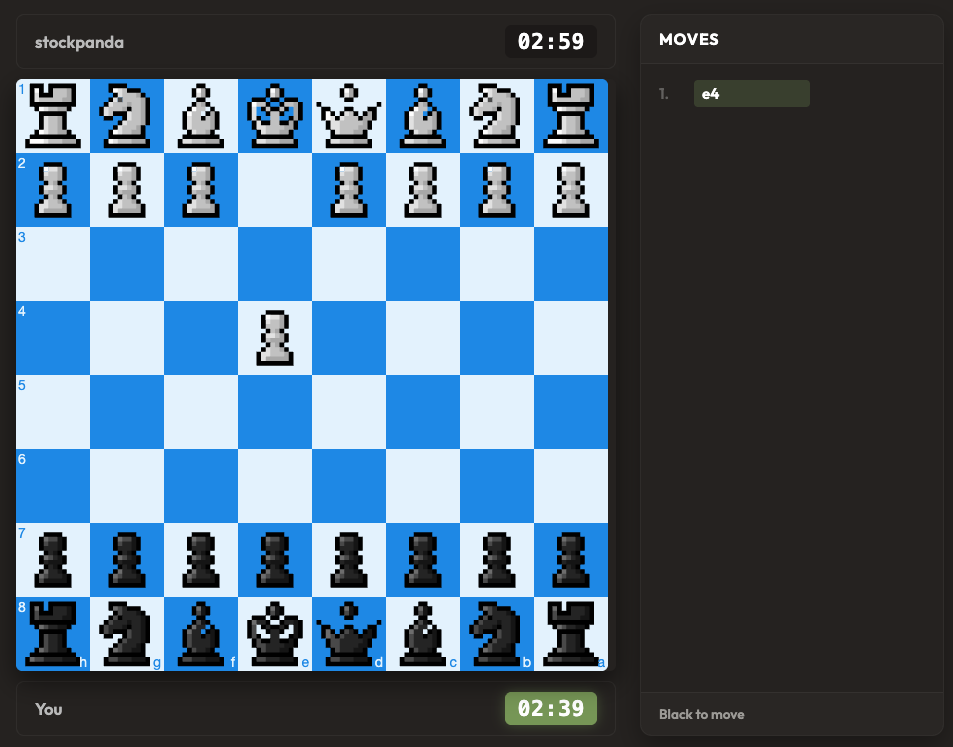

# stockpanda

an open source chess engine built with Python. try it out at https://stockpanda.vercel.app!

## screenshots

## why the name?

stockfish is the best chess engine in the world. my last name is panda. i combined the names to come up with "stockpanda"

## features of the UI

- mobile support
- board themes
- piece themes
- custom time control
- sound themes
- notation
- move by clicking or dragging
- move history
- victory animation
- custom difficulty settings
- illegal move feedback

## features of the engine

- minimax
- alpha-beta pruning
- iterative deepening
- transposition tables
- move order
- quiessence search
- opening book
- tablebase
- phase-based evaluation
- move by clicking
- board annotations (arrows + square highlighting)
- premoves

## technical info

server made with python. client made with Flask.

### credits
AI was used to complete research on the complex algorithms this engine uses to find the best mvoe possible.

big thanks to the Stardance program for making this project possible! 
